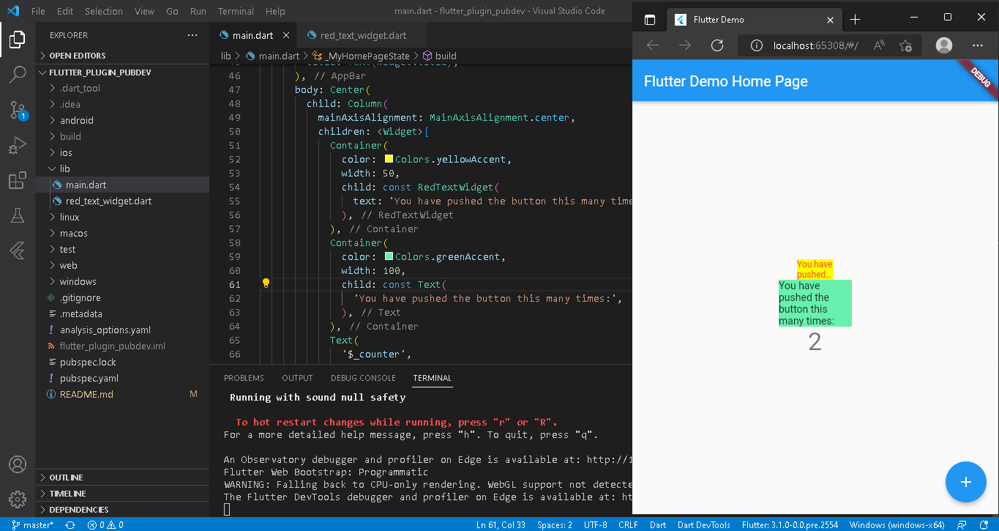

# flutter_plugin_pubdev

SILVIA NUR MAHMUDAH

## Tugas Praktikum

### 1. Selesaikan Praktikum tersebut, lalu dokumentasikan dan push ke repository Anda berupa screenshot hasil pekerjaan beserta penjelasannya di file README.md!

### 2. Jelaskan maksud dari langkah 2 pada praktikum tersebut!
Penambahan plugin auto_size_text yang berfungsi sebagai Widget Flutter yang secara otomatis mengubah ukuran teks agar pas dalam batas-batasnya. 

### 3. Jelaskan maksud dari langkah 5 pada praktikum tersebut!
variabel text ditambahkan pada konstruktor untuk dapat dipanggil melalui main.dart sehingga dapat tampil sesuai pemanggilan class RedTextWidget

### 4. Pada langkah 6 terdapat dua widget yang ditambahkan, jelaskan fungsi dan perbedaannya!
- Container 1 : memanggil class RedTextwidget yang didalamnya terdapat AutoSizeText
- Container 2 : memanggil widget Text

### 5. Jelaskan maksud dari tiap parameter yang ada di dalam plugin auto_size_text berdasarkan tautan pada dokumentasi ini !
- key* : Mengontrol bagaimana satu widget menggantikan widget lain
- textKey : Setel kunci Text widget yang dihasilkan
- style* : Gaya yang digunakan untuk text
- minFontSize : Batasan ukuran teks minimum yang akan digunakan saat mengubah text secara otomatis
- maxFontSize : Batasan ukuran teks maximum yang akan digunakan saat mengubah text secara otomatis
- stepGranularity : Ukuran langkah dimana ukuran font sedang disesuaikan dengan batasan
- presetFontSize : Mendefinisikan semua ukuran font yang mungkin *harus dalamurutan menurun
- group : Menyinkronkan ukuran beberapa AutoSizeText
- textAlign* : Text disejajarkan secara horizontal
- textDirection* : Arah text. Memutuskan bagaimana textAlign nilai disukai TextAlign.start dan TextAlign.end diinterpetasikan
- locale* : Memilih font ketika karakter Unicode yang sama dirender secara berbeda, tergantung pada lokal
- softWrap* : Apakah text harus putus pada jeda baris lunak
- wrapWords : Apakah kata-kata yang tidak cocok dalam satu baris harus dibungkus
- overflow* : Bagaimana visual overflow* harus ditangani
- overflowReplacement : Jika teks meluapdan tidak sesuai dengan batasnya, widget ini akan ditampilkan sebagai gantinya
- textScaleFactor* : Jumlah piksel font untuk setiap piksel logis
- maxLines : Jumlah maksimum baris opsional untuk text yang akan dibentangkan
- semanticsLabel* : Label semantik alternatif untuk teks